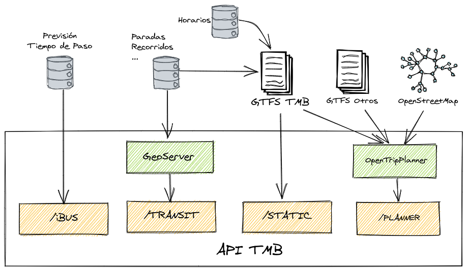

# TMB Developer Portal

***SIG Libre 2021***

|  |  |
| --- | --- |

El [Developer Portal de TMB](https://developer.tmb.cat/) es una
API REST para el acceso a datos de las redes de bus y metro de Barcelona,
e incluye los siguientes servicios:

| Servicio | Descripción |
| --- | --- |
| Transit | Descripción de la red |
| iBus | Tiempos de paso por una parada |
| Static | Descarga de fichero GTFS |
| Planner | Routing multimodal |

Cómo está hecho:

## Transit

* Oracle geospatial
* GeoServer WFS
* Capa "restificadora" programada en node

* Docs: https://developer.tmb.cat/api-docs/v1/transit
* Demo: https://geomatico.github.io/tmb-api-siglibre-2021/transit.html

## iBus

* Desarrollo java propio

* Docs: https://developer.tmb.cat/api-docs/v1/ibus
* Demo: https://www.tmb.cat/ca/barcelona/tmb-ibus/proxims-busos/-/lineabus/parada-ibus/108

## Static

* URL al GTFS: https://api.tmb.cat/v1/static/datasets/gtfs.zip

* El "servicio" más utilizado por terceros:
    * Google: https://www.google.com/maps
    * Moovit: https://moovitapp.com/barcelona-362/poi/es
    * CityMapper: https://citymapper.com/barcelona?set_region=es-barcelona

## Planner

* OpenTripPlanner
* OpenStreetMap
* GTFSs de múltiples operadores

* Docs: https://developer.tmb.cat/api-docs/v1/planner
* Demo: https://geomatico.github.io/otp-react-redux/
